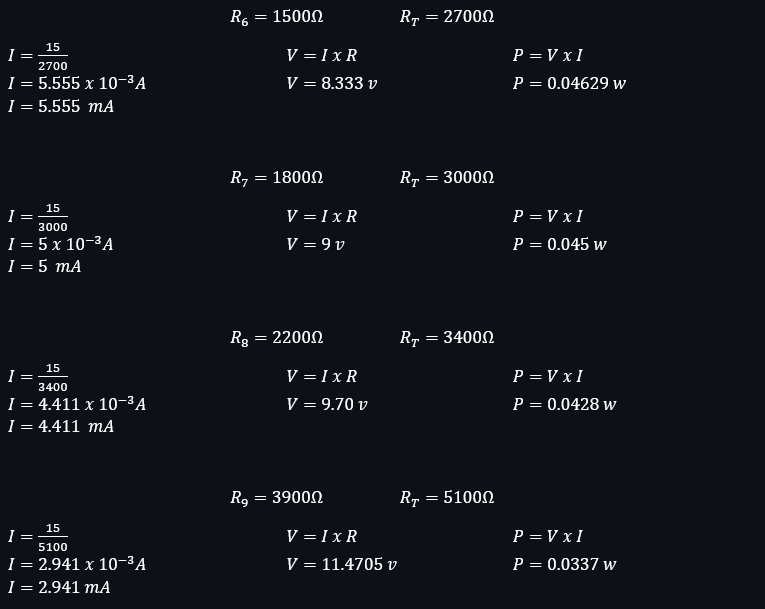
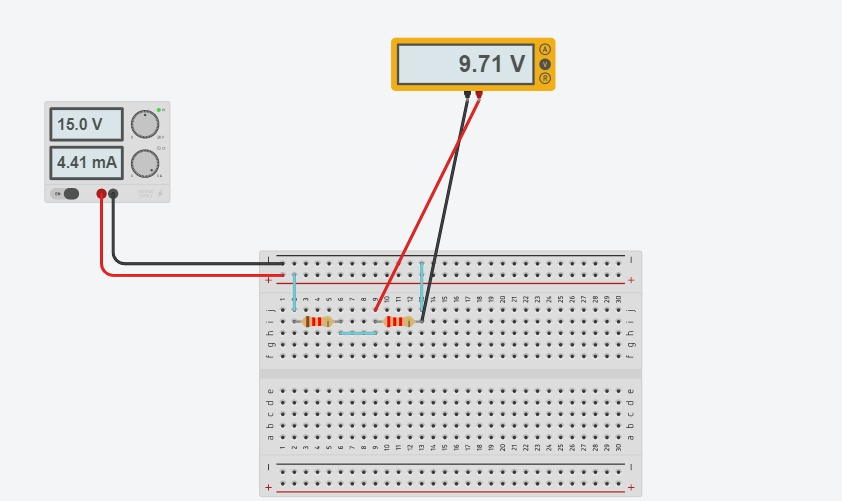

# Universidad de las Fuerzas Armadas "ESPE"

### Fundamentos de Circuitos Electricos 

**Informe Laboratorio Nº6**

**Integrantes:** Acuña Marcelo, Robalino Johanna, Villacis Isaac

**Carrera:** Ing. en Electrónica y Automatización 

**NRC:** 5406 

**Docente:** Ing. Darwin Alulema

**Tema:** Teorema " Máxima trasnferencia de potencia " 

## 1.Objetivos: 

### Generales:

* Analizar y verificar en forma experimental y analítica el teorema propuesto, comprobandos mediante cálculos, ecuaciones y uso del simulador para determinar los voltajes y las corrientes presentes en un circuito eléctrico, para asi tomar en cuenta la importancia de este teorema a partir de los datos tomados en el laboratorio.

### Especificos: 

* Conocer los fundamentos básicos de estos teoremas y su aplicación, analizando el circuito mediante la aplicación del Teorema de la Máxima Transferencia de Potencia.

* Comprobar los resultados obtenidos teóricamente mediante una simulación del circuito en la apliación Tinkerkad.

* Comprender que el teorema de la máxima transferencia de potencia, se deriva del teorema de Thevenin y el de Norton, incluyendo analisis de ecuaciones y cálculos, ayudandonos así a conocer y manejar de maneras mas simple el teorema estudiado. 

* Entender las conexiones y forma de uso del protoboard, resistencias, multímetro y de los demás materiales de laboratorio usados en el simulador para hacer un uso correcto de ellos, ya que cada material tiene una forma diferente de uso.

### 2. Marco Teorico: 

3. EXPLICACIÓN DEL PROCEDIMIENTO

Circuito Analítico

Circuito Simulado

Materiales

## 4. Video: 

## 5. Conclusiones: 

* El circuito obtenido luego de aplicar el teorema con los conocimientos previos de conceptos y aplicación es mucho más simple y rapido para calcular voltajes y corrientes.

* Al medir todas las potencias mediante las resistencias propuestas en el simlador usado, se concluyo facilmente que todos los valores coinciden con los de los resultados teorícos ayudandonos a comprobar así el Teorema de la Máxima Transferencia de Potencia.

* Llegamos a la conclusión que la máxima potencia se da cuando la carga toma de resistencia de igual a la resistencia de Thevenin o Norton.

* El reducir un circuito complejo a una fuente y resistencia de Thévenin nos ayuda para poder determinar más rápido la transferencia de potencia hacia un resistor.

* Permiten encontrar un circuito equivalente de manera simple y rápida aun en circuitos de naturaleza complicados.

* Concluimos que para el uso del simulador debemos utilizar de una manera adecuada cada uno de los materiales a usar, ya que si se tiene alguna mala conexión o algún mal uso del protoboard, multímetros, etc. se puede generar datos y valores erróneos, que pueden afectar al laboratorio estudiado. 

## 6. Bibliografia: 

* Fisica Practica. (s.f.). Teorema de la transferencia máxima de potencia. Obtenido de https://www.fisicapractica.com/transferencia.php

* innovacionumh. (s.f.). ANÁLISIS DE CIRCUITOS Y SISTEMAS LINEALES. Obtenido de Máxima transferencia de potencia.: https://innovacionumh.es/Proyectos/P_19/Tema_1/UMH_09.htm

* Fundamentos de Circuitos Eléctricos. Charles K. Alexander y Matthew N. O. Sadiku. McGraw-Hill Companies, Inc.

* ANÁLISIS DE CIRCUITOS EN INGENIERÍA, W.H. Hayt. Ed. McGraw-Hill, 1993.

